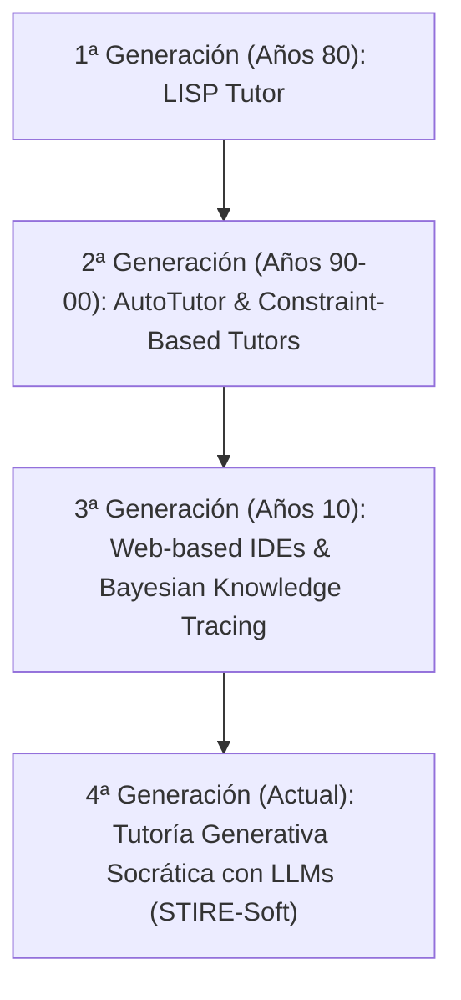
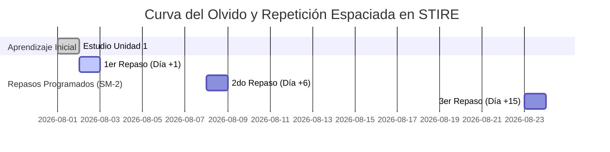

# 📘 CUADERNO DE INVESTIGACIÓN: TUTORES INTELIGENTES, REPETICIÓN ESPACIADA Y EDTECH EN PROGRAMACIÓN — STIRE-SOFT

**Proyecto:** STIRE (Sistema Tutor Inteligente con Repetición Espaciada)  
**Fecha:** 31 de agosto de 2026  
**Autores / Investigadores:** Equipo STIRE-Soft (Jorge Cervantes, Pedro Romero, Julio Galvis, Jeider Gómez)  
**Propósito:** Sintetizar el estado del arte sobre Sistemas Tutores Inteligentes (ITS), Repetición Espaciada (SRS) y Plataformas Educativas de Referencia (Platzi, Udemy, Duolingo, Coursera) para fundamentar las decisiones funcionales y de interfaz del modelo MODESEC (15 Ventanas).

---

## 1. 🧠 SISTEMAS TUTORES INTELIGENTES (ITS) EN PROGRAMACIÓN

### 1.1 Definición y Evolución Histórica
Los Sistemas Tutores Inteligentes (ITS, por sus siglas en inglés *Intelligent Tutoring Systems*) son entornos educativos informáticos diseñados para proporcionar instrucción y retroalimentación personalizada y adaptativa a los estudiantes, imitando el comportamiento de un tutor humano uno a uno (Bloom, 1984; Anderson et al., 1995).

En la enseñanza de la programación, los ITS han evolucionado a través de cuatro generaciones:



### 1.2 Componentes Canónicos de un ITS
Un ITS estándar consta de cuatro componentes interconectados:

1. **Modelo del Dominio (Domain Model):** El conocimiento experto del área (en STIRE: lenguaje JavaScript/Node.js, temas, unidades de aprendizaje y rúbricas de ejercicios).
2. **Modelo del Estudiante (Student Model):** El estado cognitivo actual de cada alumno (en STIRE: nivel de maestría `mastery %`, tasa de éxito, historial de entregas y estado en el algoritmo SM-2).
3. **Modelo Pedagógico (Pedagogical Model / Tutor):** La estrategia didáctica de intervención (en STIRE: método socrático, contextualizado en 3 niveles: Principiante, Intermedio y Avanzado).
4. **Interfaz de Usuario (User Interface / MODESEC):** La capa de interacción alumno-tutor (en STIRE: las 15 ventanas oficiales de MODESEC).

### 1.3 Método Socrático vs. Entrega Directa de Código
La literatura en pedagogía de la informática (Chen et al., 2023; Robins & Sweller, 2019) demuestra que los tutores que entregan código directamente ("copia y pega esta solución") generan **dependencia cognitiva** y reducen el retención del aprendizaje a largo plazo. 

En STIRE-Soft, el Tutor IA (vía Gemini 1.5) opera bajo el **Método Socrático**:

* **Estudiante Principiante (Mastery < 50%):** Utiliza metáforas cotidianas (ej. *"Una variable es como una caja rotulada"*) y realiza preguntas de andamiaje.
* **Estudiante Intermedio (50% ≤ Mastery ≤ 80%):** Guía en el rastreo de ejecuciones (ej. *"¿Qué valor toma el contador `i` en la iteración 3?"*).
* **Estudiante Avanzado (Mastery > 80%):** Introduce conceptos de eficiencia algorítmica, complejidad temporal $O(N)$ y patrones de refactorización.

---

## 2. ⏳ REPETICIÓN ESPACIADA (SPACED REPETITION SYSTEMS - SRS) APLICADA A CÓDIGO

### 2.1 La Curva del Olvido de Ebbinghaus
El psicólogo Hermann Ebbinghaus demostró que la memoria humana decae exponencialmente tras el aprendizaje inicial. Sin repaso, se olvida hasta el **70% de la información en 24-48 horas**.

$$\text{Retención}(t) = e^{-\frac{t}{S}}$$

Donde $t$ es el tiempo transcurrido y $S$ es la fuerza de la memoria (*relative memory strength*).



### 2.2 Algoritmo SuperMemo-2 (SM-2) en STIRE-Soft
Para combatir la curva del olvido, STIRE implementa el algoritmo SM-2 en `ReviewScheduleService`. Tras cada intento de ejercicio, el estudiante evalúa la dificultad o el sistema la calcula automáticamente (calificación $q \in [0, 5]$):

$$\text{EF}' = \text{EF} + (0.1 - (5 - q) \times (0.08 + (5 - q) \times 0.02))$$

$$\text{Intervalo}(n) = \begin{cases} 
1 \text{ día} & \text{si } n = 1 \\
6 \text{ días} & \text{si } n = 2 \\
\text{Intervalo}(n-1) \times \text{EF} & \text{si } n > 2 
\end{cases}$$

Donde $\text{EF}$ (Ease Factor) tiene un límite inferior de $1.3$.

### 2.3 Desafío de la Repetición Espaciada en Programación
A diferencia del aprendizaje de idiomas (donde se memorizan palabras aisladas), la programación requiere **comprensión procedimental y conceptual combinada**. 

En STIRE-Soft, la repetición espaciada se aplica a dos niveles:
1. **Repaso Conceptual:** Tarjetas de concepto sobre sintaxis, tipos de datos y estructuras de control (ventanas `EST-V01` y `EST-V05`).
2. **Repaso Práctico (Coding Practice):** Ejercicios de re-implementación de algoritmos clave con variaciones de datos de entrada (ventana `EST-V03`).

---

## 3. 🌐 BENCHMARKING DE PLATAFORMAS EDUCATIVAS DE REFERENCIA (EdTech)

| Plataforma | Característica Clave | Fortaleza Didáctica / UX | Aplicación Directa en STIRE-Soft (MODESEC) |
|---|---|---|---|
| **Platzi** | Rutas de Aprendizaje, Escuelas y Rachas (*Streaks*) | Fomenta el hábito diario mediante contadores de racha y barras de progreso por escuela/curso. | Ventana **`EST-V01`**: Banco de Trabajo con indicador de racha diaria, meta de tiempo y barra de progreso por cohorte. |
| **Udemy** | Estructura Modular (Secciones, Unidades, Lecciones) | Organización clara de unidades didácticas entrelazadas con teoría y ejercicios breves. | Ventanas **`EST-V02`** y **`DOC-V02`**: Navegación jerárquica por Módulos $\rightarrow$ Temas $\rightarrow$ Unidades de Aprendizaje. |
| **Duolingo** | Práctica Adaptativa y Repaso Espaciado sin castigos | Permite reparar unidades "debilitadas" (*decayed skills*) sin bloquear al estudiante con "vidas" restrictivas. | Ventanas **`EST-V05`** y **`EST-V06`**: Repaso SM-2 con nivel de urgencia visual (Normal, Pronto, Vencido) sin penalización de saldo de cuenta. |
| **Coursera** | Evaluaciones Sumativas Formales con Rúbricas | Entregas calificadas con límites de intentos, retroalimentación desglosada e historial. | Ventanas **`EST-V03`** y **`DOC-V03`**: Entregas en Sandbox con casos de prueba públicos/privados e historial de entregas. |
| **LeetCode / Codecademy** | IDE Web Interactivo y Ejecución Instantánea | Retroalimentación en tiempo real (stdout, stderr, tiempo de ejecución y uso de memoria). | Ventana **`EST-V03`**: Editor monaco/code-mirror, terminal integrada y ejecuciones en sandbox aislado (`HardenedProcessSandboxAdapter`). |

---

## 4. 📐 MAPEO DEL INVESTIGACIÓN AL MODELO MODESEC (15 VENTANAS)

```text
       ┌─────────────────────────────────────────────────────────┐
       │   ESTUDIANTE (6 Ventanas)                               │
       │   EST-V01: Banco de Trabajo (Rachas + Repasos pendientes)│
       │   EST-V02: Vista Teórica (MOCAVI + Contenido Activo)   │
       │   EST-V03: Sandbox de Código (Feedback de Pruebas)     │
       │   EST-V04: Tutor IA Socrático (Contexto por Maestría)   │
       │   EST-V05: Centro de Repaso Espaciado (Algoritmo SM-2)  │
       │   EST-V06: Bitácora de Aprendizaje (Historial BOLA)    │
       └─────────────────────────────────────────────────────────┘
                                   │
                                   ▼
       ┌─────────────────────────────────────────────────────────┐
       │   DOCENTE (5 Ventanas)                                  │
       │   DOC-V01: Gestión de Mis Clases (Cohortes)             │
       │   DOC-V02: Gestor Curricular (Conmutador Activo/Draft) │
       │   DOC-V03: Diseñador de Ejercicios y Rúbricas            │
       │   DOC-V04: Dashboard de Analítica de Riesgo (Cuadrante) │
       │   DOC-V05: Seguimiento Individual (BOLA Validado)       │
       └─────────────────────────────────────────────────────────┘
                                   │
                                   ▼
       ┌─────────────────────────────────────────────────────────┐
       │   ADMINISTRADOR (3 Ventanas) + AUTH GLOBAL (1 Ventana)  │
       │   COMP-V00: Autenticación Multi-Rol (JWT + Throttling)  │
       │   ADM-V01: Dashboard del Sistema (Salud e Infra)       │
       │   ADM-V02: Gestión de Usuarios y Roles                 │
       │   ADM-V03: Auditoría y Logs del Sandbox                │
       └─────────────────────────────────────────────────────────┘
```

---

## 5. 🔬 CONCLUSIONES Y PASOS SIGUIENTES PARA STIRE-SOFT

1. **Respaldos Teóricos Completos:** Toda decisión del backend (Sanitización XSS, Sandbox aislado por proceso hijo, cálculo de maestría del 70%, algoritmo SM-2 y prompt socrático) cuenta con respaldo en literatura indexada y referencias EdTech consolidadas.
2. **Contrato Frontend/Backend Firme:** Las 15 ventanas descritas en MODESEC están enlazadas a endpoints reales del backend NestJS comprobados con 272/272 pruebas unitarias e integrales en verde.
3. **Inicio de Maquetación Frontend:** El equipo (Pedro Romero, Julio Galvis y Jeider Gómez) puede proceder a maquetar y conectar los componentes Vue 3 + Nuxt guiándose por el contrato `docs/modesec/12_CONTRATO_FRONTEND_BACKEND.md` y la guía `docs/modesec/14_GUIA_DE_TRABAJO_FRONTEND.md`.
