# FASE II — DISEÑO MULTIMEDIAL (MODESEC)
## STIRE-Soft · Sistema Tutor Inteligente para la Resolución de Ejercicios

| Campo | Valor |
|---|---|
| **Proyecto** | STIRE-Soft (LMS adaptativo con tutor IA) |
| **Norma aplicada** | `DDS3-01.pdf` — GUIA MODESEC, §3 Fase II: Diseño Multimedial |
| **Fuente base** | Caro, Toscano, Hernández y David (2012), *MODESEC*, cap. 3 (Formatos 10 a 14) |
| **Modelo pedagógico** | MOCAVI |
| **Nivel educativo** | Universitario — 3.er semestre, Licenciatura en Informática |
| **Asignatura** | Fundamentos de Algoritmia |
| **Población objetivo** | 18–22 años · alfabetización digital media · sin experiencia previa de programación formal |
| **Versión** | v2.0 — Fase II completa (§3.1 a §3.3.3) |
| **Fecha** | 2026-08-28 |

> ⚙️ **Este documento es generado.** Consolida las seis secciones de la Fase II para leerlas de un
> tirón y para la entrega al docente. **La fuente de verdad son los archivos individuales**
> (`contenidos/`, `guiones/`, `ventanas/`): edítalos allí y vuelve a generar este consolidado.
> El índice, el estado por sección y los responsables están en [`README.md`](README.md).

**Contenido:** §3.1 Diagrama de contenidos · §3.2 Guión técnico multimedial (Formatos 10 y 11) ·
§3.3 Ventana estándar (Formato 12) · §3.3.1 Fichas de ventanas (Formato 13) ·
§3.3.2 Guía de metáforas (Formato 14) · §3.3.3 Mapa de navegación (Gráfico 2).

**Lo que aún no está en Fase II:** producción del video de unidad y de la animación de trazado
(§3.2.3), y verificación de los endpoints citados en las fichas. Detalle y plan en
[`01_GAP_Y_PLAN.md`](01_GAP_Y_PLAN.md).

---

# § 3.1 · Diagrama de Contenidos — STIRE

**Proyecto:** STIRE-Soft · **Curso:** DDSE3 2026-2 · **Norma:** `DDS3-01.pdf` §3.1 · MODESEC §3.1
**Dueño:** Julio · **Estado:** ✅ completo · **Última actualización:** 2026-08-28

---

## 1. Representación elegida y por qué

MODESEC §3.1.1 admite tres formas de representar los contenidos: **mentefacto**, **mapa conceptual**
o **mapa mental**. Elegimos **mapa mental radial** porque el contenido de algoritmia es jerárquico y
acumulativo: cada módulo se apoya en el anterior, y el mapa mental muestra esa dependencia de un
vistazo. Un mentefacto habría exigido supraordinadas e infraordinadas que aquí no aportan, y un mapa
conceptual con proposiciones etiquetadas habría duplicado lo que ya dice la tabla de resultados de
aprendizaje.

---

## 2. Diagrama (Gráfico 1)

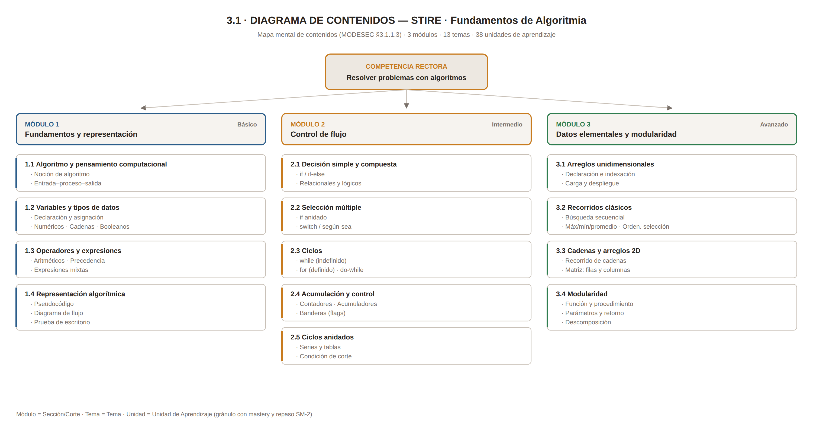

*Fuente editable: [`assets/3.1_diagrama_contenidos.svg`](assets/3.1_diagrama_contenidos.svg)*

<details>
<summary>Versión en Mermaid (se renderiza directamente en GitHub)</summary>

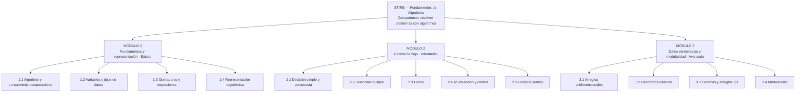
</details>

---

## 3. Correspondencia con la estructura de datos de STIRE

| Nivel MODESEC | Nivel en el sistema | Qué se le asigna |
|---|---|---|
| Módulo | Sección / Corte | agrupación curricular |
| Tema | Tema | agrupación conceptual |
| Unidad de aprendizaje | **Unidad de Aprendizaje** | `mastery`, `review_schedule`, historial de progreso |
| — | Contenido teórico y Actividad | material (PDF, video, Markdown) y preguntas |

La **unidad de aprendizaje es el gránulo mínimo evaluable**: es lo que se domina, lo que se repasa
y lo que se desbloquea. Por eso el diagrama llega hasta ese nivel y no se detiene en el tema.

---

## 4. Tabla de contenidos y resultados de aprendizaje

| Módulo | Tema | Unidades de aprendizaje | Resultado de aprendizaje (verbo observable) | Nivel |
|---|---|---|---|---|
| **1. Fundamentos y representación** | 1.1 Algoritmo y pensamiento computacional | Noción de algoritmo · Entrada-proceso-salida | **Descompone** un enunciado en entradas, proceso y salidas identificando qué dato produce el resultado | Básico |
| | 1.2 Variables y tipos de datos | Declaración y asignación · Numéricos · Cadenas · Booleanos | **Declara y asigna** variables del tipo correcto, justificando la elección | Básico |
| | 1.3 Operadores y expresiones | Aritméticos · Precedencia · Expresiones mixtas | **Evalúa** expresiones respetando la precedencia y **predice** el resultado antes de ejecutar | Básico |
| | 1.4 Representación algorítmica | Pseudocódigo · Diagrama de flujo · Prueba de escritorio | **Representa** un algoritmo en pseudocódigo y lo **verifica** con 3 casos de escritorio | Básico |
| **2. Control de flujo** | 2.1 Decisión simple y compuesta | if / if-else · Relacionales · Lógicos | **Construye** algoritmos que seleccionan entre alternativas excluyentes | Intermedio |
| | 2.2 Selección múltiple | if anidado · switch | **Reestructura** decisiones anidadas en una selección múltiple equivalente y más legible | Intermedio |
| | 2.3 Ciclos | while · for · do-while | **Diseña** ciclos con condición de corte correcta y **detecta** ciclos infinitos por trazado | Intermedio |
| | 2.4 Acumulación y control | Contadores · Acumuladores · Banderas | **Implementa** contadores y acumuladores para totales, promedios y conteos condicionados | Intermedio |
| | 2.5 Ciclos anidados | Series y tablas · Condición de corte | **Construye** ciclos anidados y **explica** la relación entre iteración externa e interna | Intermedio |
| **3. Datos elementales y modularidad** | 3.1 Arreglos unidimensionales | Declaración · Indexación · Carga y despliegue | **Manipula** arreglos accediendo por índice sin desbordar los límites | Avanzado |
| | 3.2 Recorridos clásicos | Búsqueda secuencial · Máx/mín/promedio · Ordenamiento por selección | **Aplica** el recorrido adecuado y **compara** su costo en número de comparaciones | Avanzado |
| | 3.3 Cadenas y arreglos 2D | Recorrido de cadenas · Matriz filas/columnas | **Recorre** estructuras bidimensionales resolviendo conteo y transformación | Avanzado |
| | 3.4 Modularidad | Función y procedimiento · Parámetros y retorno · Descomposición | **Descompone** un problema en funciones de responsabilidad única y **reutiliza** las ya construidas | Avanzado |

**Criterio de calidad aplicado:** ningún resultado empieza por *conocer* o *entender*. Un resultado
que no se puede medir con un ejercicio no puede alimentar el motor de dominio del sistema.

---

## 5. Reglas de progresión (enlace con el motor de dominio)

| Regla | Valor | Dónde vive en el sistema |
|---|---|---|
| Desbloqueo de la siguiente unidad | `mastery ≥ 70 %` | `minMasteryRequired` (grafo de prerrequisitos) |
| Estado **Dominado** | `mastery ≥ 85 %` | `learning_progress.mastery` |
| Tutoría socrática proactiva | `mastery < 60 %` tras 2 intentos | `TutorService` |
| Programación de repaso | SM-2, intervalo con techo de 60 días | `review_schedules.nextReviewDate` |
| Prerrequisito entre módulos | M1 → M2 → M3 secuencial; dentro del módulo orden flexible salvo 2.3 → 2.4 → 2.5 | grafo de prerrequisitos |

⚠️ Estos umbrales son **propuesta de diseño**: requieren validación con el docente titular.

---

## 6. Pendiente conocido

Según MODESEC §2.5, los contenidos deben **derivarse del formato de competencias (Formato 5)** de la
Fase I. Ese formato aún no existe (ver `../01_GAP_Y_PLAN.md`, tarea 1). Al construirlo, este
diagrama debe revisarse y corregirse en lo que no trace. Está registrado como tarea P0.

---

# § 3.2 · Guión Técnico Multimedial — STIRE

**Norma:** MODESEC §3.2 · Formatos **10** (guión didáctico) y **11** (guión técnico) · `DDS3-01.pdf` §3.2
**Estado:** ✅ guiones completos · 🟡 producción de recursos pendiente · **Última actualización:** 2026-08-28

> **Qué es esta pieza.** El guión técnico multimedial describe, con detalle de producción, *qué se ve
> y se oye en cada pantalla*: textos, imágenes, sonidos, su formato, su fuente, la acción que
> ejecutan y el evento que la dispara. Es el puente entre el diseño pedagógico (Fase I) y la
> implementación (Fase IV): sin él, cada quien inventa la pantalla a su manera.

---

## 1. Guión didáctico — Formato 10

| Campo | Contenido |
|---|---|
| **Título** | STIRE — Sistema Tutor Inteligente para la Resolución de Ejercicios · Fundamentos de Algoritmia |
| **Sinopsis de la temática** | Entorno de práctica algorítmica donde el estudiante resuelve ejercicios verificados por un juez automático, recibe tutoría socrática de un agente de IA que no entrega la solución, y consolida lo aprendido mediante repaso espaciado (SM-2). El avance se rige por dominio (*mastery learning*): no se accede a la siguiente unidad hasta demostrar la anterior. |
| **Finalidad educativa** | Desarrollar la competencia de resolución de problemas computacionales, integrando las dimensiones cognitiva (comprender estructuras de control y datos), procedimental (construir, trazar y depurar algoritmos) y actitudinal (persistir ante el error y argumentar decisiones de diseño). |
| **Objetivos didácticos** | 1. Que el estudiante represente algoritmos en pseudocódigo y los verifique con casos de prueba. 2. Que seleccione la estructura de control adecuada al problema. 3. Que descomponga problemas en funciones de responsabilidad única. 4. Que use la retroalimentación del tutor como insumo de análisis, no como respuesta. |
| **Contextos valorativos** | **Honestidad académica** (el tutor no resuelve por el estudiante; los casos privados no se exponen), **persistencia** (el error es prueba de banco, no sanción), **rigor** (un algoritmo se declara correcto solo si pasa la verificación) y **colaboración** (MOCAVI: el trabajo se comparte y se argumenta). |
| **Características de la población objetivo** | Estudiantes de Licenciatura en Informática de la Universidad de Córdoba, con acceso a sala de cómputo compartida y equipo propio de gama media; alfabetización digital media; primera experiencia formal con programación. |
| **Rango de edades** | 18 – 22 años |
| **Características psicológicas** | Pensamiento formal en consolidación; **alta ansiedad ante el error de compilación** y tendencia a atribuirlo a incapacidad personal; motivación sensible al progreso visible; baja tolerancia a la espera (>3 s) y a la ambigüedad del enunciado; capacidad de autorregulación aún en desarrollo, que requiere que el sistema haga visible el estado del aprendizaje. |
| **Nivel académico** | Universitario — 3.er semestre |
| **Unidad temática** | Fundamentos de Algoritmia: representación, control de flujo, estructuras de datos elementales y modularidad |

**Por qué se llenó así:** las características psicológicas no son un adorno del formato. De la
ansiedad ante el error salen tres decisiones de interfaz que aparecen en §3.3: *Ejecutar* separado
de *Entregar*, autoguardado visible en el footer, y un tutor que responde con preguntas en lugar de
correcciones. De la baja tolerancia a la espera sale el indicador de estado del juez en V-03.

---

## 2. Guión técnico — Formato 11

Un bloque por ventana. Filas: **Texto · Imagen · Sonido** (las tres categorías del formato).

### V-01 · Mi banco de trabajo

| Título de la Ventana | Descripción | Formato / fuente | Acción | Evento |
|---|---|---|---|---|
| **Texto** | Saludo (1 línea), tres tarjetas de estado, métricas de dominio. Sans serif humanista 14–16 px, color `#2B2622`, interlínea 1.5 | UTF-8 renderizado desde Markdown · fuente: producción propia + API `learning-progress` | Muestra el estado real del estudiante; cada tarjeta enlaza a su ventana | Al cargar la ventana (`onLoad`) |
| **Imagen** | Iconografía lineal 24 px (banco de trabajo, mantenimiento, bitácora) e ilustración de cabecera plana | SVG · producción propia (`assets/icons/`) | Icono clicable: navega a la sección correspondiente | Clic sobre el icono o su etiqueta |
| **Sonido** | No se utiliza | — | — | — |

### V-02 · Unidad de aprendizaje (contenido teórico)

| Título de la Ventana | Descripción | Formato / fuente | Acción | Evento |
|---|---|---|---|---|
| **Texto** | Cuerpo teórico en bloques ≤150 palabras; ejemplos de código en monoespaciada 14 px sobre fondo `#F6F3EF`; glosario emergente en términos marcados | Markdown renderizado (UTF-8) · autoría del equipo, revisada por el docente | Muestra teoría y ejemplo; el glosario despliega la definición | `onLoad` · `mouseover` sobre término marcado |
| **Imagen** | Diagramas de flujo y esquemas conceptuales, con texto alternativo descriptivo | SVG · producción propia | Ampliar el diagrama sin pérdida de nitidez | Clic sobre el diagrama |
| **Sonido** | No hay locución producida; se soporta la lectura por voz del navegador | — (tecnología asistiva del sistema) | Lee el texto para el usuario que lo solicite | Activación desde el lector de pantalla |
| **Video** | Cápsula de 3–6 min por unidad, subtitulada, con control de velocidad y transcripción | MP4 H.264 720p + WebVTT · **producción pendiente** | Reproduce, pausa, cambia velocidad, descarga transcripción | Clic en ▶ / controles del reproductor |
| **Animación** | Trazado de escritorio paso a paso: resalta la línea en ejecución y actualiza la tabla de variables | SVG + JS (sin dependencias de video) · producción propia | Avanza o retrocede un paso del trazado | Clic en ◀ / ▶ (nunca automático) |

### V-03 · Resolución de ejercicio

| Título de la Ventana | Descripción | Formato / fuente | Acción | Evento |
|---|---|---|---|---|
| **Texto** | Enunciado estructurado ≤200 palabras (contexto, entrada, salida, restricciones), ejemplos E/S, contador de intentos. Editor en monoespaciada 14 px con numeración de línea | UTF-8 · banco de ejercicios propio | Envía el código al juez; muestra el resultado por caso | Clic en **Ejecutar** (no consume intento) / **Entregar** (consume intento, con confirmación) |
| **Imagen** | Iconos de estado por caso de prueba: ✔ pasa, ✖ falla, ⏱ tiempo excedido | SVG · producción propia | Cambia el estado visual del caso al recibir el veredicto | Respuesta del juez (`onJudgeResult`) |
| **Sonido** | Dos señales cortas y **desactivadas por defecto**: éxito y fallo de la ejecución | WAV/OGG ≤1 s · biblioteca libre de derechos, **pendiente de selección** | Avisa del fin de la ejecución sin mirar la pantalla | Fin de la ejecución del juez |
| **Animación** | Indicador de progreso del sandbox: en cola → ejecutando → evaluando; los casos se revelan en secuencia | CSS + SVG · producción propia | Comunica que el sistema no está congelado | Envío al juez |

### V-04 · Maestro de taller (tutor IA)

| Título de la Ventana | Descripción | Formato / fuente | Acción | Evento |
|---|---|---|---|---|
| **Texto** | Turnos ≤80 palabras; el tutor responde con preguntas guía y contraejemplos. Aviso permanente: *"Respuestas generadas por IA: verifícalas ejecutando tu algoritmo"* | UTF-8 · generado por el motor de tutoría sobre el contexto del estudiante | Envía la consulta con el fragmento de código adjunto y devuelve la respuesta | Clic en **Enviar** / atajo `Ctrl+Enter` |
| **Imagen** | Avatar geométrico abstracto (no humanoide) y marcas que distinguen los turnos | SVG · producción propia | Identifica visualmente quién habla | `onLoad` |
| **Sonido** | **No se utiliza, por decisión pedagógica:** sintetizar voz sobre texto generado por IA aumenta la percepción de autoridad de una fuente falible | — | — | — |
| **Animación** | Indicador de escritura y entrega progresiva del texto | CSS · producción propia | Evita la percepción de sistema colgado | Mientras se genera la respuesta |

### V-05 · Mantenimiento (repaso espaciado)

| Título de la Ventana | Descripción | Formato / fuente | Acción | Evento |
|---|---|---|---|---|
| **Texto** | Lista de unidades por vencer con **justificación de una línea** por cada una y explicación del intervalo SM-2 | UTF-8 · calculado por el motor de repaso | Inicia el repaso, lo pospone con motivo o muestra el historial | Clic en la tarjeta / botón **Posponer** |
| **Imagen** | Iconos de urgencia con doble codificación forma + color + etiqueta (⬤ al día, ◐ mañana, ▲ vencido, ■ crítico) | SVG · producción propia | Comunica prioridad sin depender del color | `onLoad` |
| **Sonido** | No se utiliza | — | — | — |
| **Animación** | Al completar un repaso, la tarjeta sale de la lista y aparece la nueva fecha (≤300 ms) | CSS · producción propia | Hace visible que el intervalo se extendió | Fin del repaso |

### V-06 · Mi bitácora (progreso)

| Título de la Ventana | Descripción | Formato / fuente | Acción | Evento |
|---|---|---|---|---|
| **Texto** | Métricas (`mastery`, `successRate`, intentos, racha) **cada una con su línea de interpretación** | UTF-8 · API de progreso | Filtra por módulo o fecha; sugiere la unidad más débil | Cambio en el filtro · `onLoad` |
| **Imagen** | Barras de dominio, mapa de calor de actividad y línea de evolución, sin efectos 3D | SVG generado en cliente · producción propia | Amplía o exporta el reporte | Clic en **Exportar** |
| **Sonido** | No se utiliza | — | — | — |
| **Animación** | Las barras crecen desde cero al cargar (400 ms); se resalta lo que cambió desde la última visita | CSS · producción propia | Dirige la atención al cambio, no al adorno | `onLoad` |

---

## 3. Selección y producción de recursos multimedia — §3.2.3

MODESEC advierte que **los materiales multimedia solo se usan cuando aportan algo relevante al
aprendizaje**. Este es nuestro inventario, con su estado real:

| Recurso | Tipo | Aporte pedagógico que justifica su uso | Origen | Estado |
|---|---|---|---|---|
| Iconografía del sistema (12 metáforas) | Imagen SVG | Sostiene la metáfora rectora y permite reconocer funciones sin leer | Producción propia | ✅ producido (`assets/icons/`) |
| Diagramas de flujo de las unidades | Imagen SVG | Representación alterna del algoritmo, exigida por la unidad 1.4 | Producción propia | 🟡 en producción |
| Cápsulas de video por unidad (3–6 min) | Video MP4 + subtítulos | Apoyo para quien prefiere explicación hablada; **no sustituye el texto** | Producción propia | 🔴 no iniciado |
| Animación de trazado de escritorio | SVG + JS | **El de mayor valor pedagógico:** hace visible el estado de la memoria durante la ejecución | Producción propia | 🔴 no iniciado |
| Señales sonoras de ejecución (2) | WAV/OGG ≤1 s | Permite no mirar la pantalla durante la espera del juez | Biblioteca libre de derechos | 🔴 sin seleccionar |
| Locución / voz en off | Audio | **Descartado deliberadamente.** Impone ritmo sobre la lectura de código y, en el tutor, atribuye autoridad a una fuente falible | — | ⛔ no aplica (justificado) |

**Riesgo declarado:** si la animación de trazado no alcanza a producirse, se degrada a **trazado
estático tabulado** y se documenta en `RELEASE_NOTES.md`. No se elimina en silencio.

---

## 4. Trazabilidad

Cada ventana de este guión tiene su ficha de 7 categorías en
[`../ventanas/3.3.1_FICHAS_VENTANAS.md`](ventanas/3.3.1_FICHAS_VENTANAS.md) y su posición en el
sistema en [`../contenidos/3.3.3_MAPA_NAVEGACION.md`](contenidos/3.3.3_MAPA_NAVEGACION.md).

---

# § 3.3 · Ventana Estándar — STIRE

**Norma:** MODESEC §3.3.1.1 · **Formato 12** (Descripción de la ventana estándar) · `DDS3-01.pdf` §3.3
**Dueño:** José · **Estado:** ✅ completo · **Última actualización:** 2026-08-28

---

## 1. Formato 12 — Descripción de la ventana estándar

<table>
<tr><th colspan="2" align="center">DESCRIPCIÓN DE LA VENTANA ESTÁNDAR</th></tr>
<tr><td colspan="2" align="center">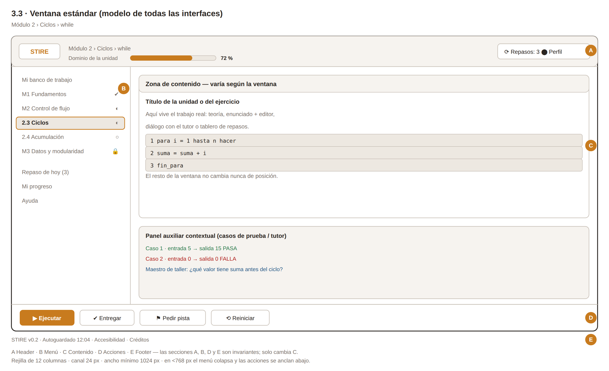</td></tr>
<tr><td width="180"><b>Título de la ventana</b></td><td>Ventana estándar STIRE (modelo de todas las interfaces)</td></tr>
<tr><td><b>Descripción</b></td><td>Es la ventana modelo de la que derivan todas las interfaces del sistema. Se divide en cinco secciones funcionales —Header, Menú, Contenido, Acciones y Footer— de las cuales <b>cuatro son invariantes</b>: solo cambia la zona de contenido. El estudiante encuentra siempre los mismos controles en el mismo lugar, de modo que el esfuerzo mental se invierte en el algoritmo y no en la interfaz.</td></tr>
</table>

*Fuente editable: [`assets/3.3_ventana_estandar.svg`](assets/3.3_ventana_estandar.svg)*

---

## 2. Maqueta en texto (referencia rápida)

```
╔══════════════════════════════════════════════════════════════════════════════════╗
║ [A] HEADER — logo · ruta Módulo › Tema › Unidad · barra de dominio · repasos      ║
╠═══════════════════════╤══════════════════════════════════════════════════════════╣
║ [B] MENÚ  (260 px)    │ [C] ZONA DE CONTENIDO                                     ║
║  ▸ Mi banco de trabajo│   ┌────────────────────────────────────────────────────┐  ║
║  ▾ M1 Fundamentos  ✔  │   │  Título de la unidad o del ejercicio                │ ║
║      1.1 Algoritmo ✔  │   │  teoría · enunciado + editor · tutor · repasos      │ ║
║  ▾ M2 Control      ◐  │   └────────────────────────────────────────────────────┘  ║
║      2.3 Ciclos    ◐  │   ┌────────────────────────────────────────────────────┐  ║
║      2.4 Acumular  ○  │   │  Panel auxiliar contextual (casos de prueba/tutor)  │ ║
║  ▸ M3 Datos        🔒 │   └────────────────────────────────────────────────────┘  ║
║  ⟳ Repaso de hoy  (3) │                                                           ║
║  ▤ Mi progreso        │                                                           ║
╠═══════════════════════╧══════════════════════════════════════════════════════════╣
║ [D] ACCIONES — [ ▶ Ejecutar ] [ ✔ Entregar ] [ ⚑ Pedir pista ]   [ ⟲ Reiniciar ] ║
╠══════════════════════════════════════════════════════════════════════════════════╣
║ [E] FOOTER — STIRE v0.2 · Autoguardado 12:04 · Accesibilidad · Créditos           ║
╚══════════════════════════════════════════════════════════════════════════════════╝
```

**Rejilla:** 12 columnas · canal 24 px · ancho mínimo 1024 px. En <768 px el menú [B] colapsa a
desplegable y las acciones [D] se anclan al borde inferior.

---

## 3. Descripción por secciones — lo que exige la norma

> MODESEC: *"la ventana estándar se diseña por secciones que deben ser explicadas detalladamente
> para precisar la división de la ventana"*. La columna que importa no es qué contiene cada sección,
> sino **por qué está ahí**.

| Sección | Elementos | Función pedagógica |
|---|---|---|
| **[A] Header** | Marca, ruta *Módulo › Tema › Unidad*, barra de dominio de la unidad, contador de repasos, perfil | Ancla al estudiante en el **mapa del conocimiento**: siempre sabe qué estudia, cuánto le falta para el umbral y qué deuda de repaso tiene. Hace visible el *mastery learning*, que de otro modo sería invisible y no regularía la conducta de estudio. |
| **[B] Menú** | Árbol Módulo → Tema → Unidad con estado (✔ dominado, ◐ en práctica, ○ explorado, 🔒 bloqueado) + repaso, progreso y ayuda | Materializa el **grafo de prerrequisitos**: el candado no es una restricción administrativa sino información pedagógica ("aún no tienes la base"). El estado por unidad sostiene la **autorregulación**: el estudiante decide dónde invertir esfuerzo con datos, no por intuición. |
| **[C] Contenido** | Zona principal (teoría, enunciado + editor, diálogo del tutor o tablero de repaso) + panel auxiliar | Concentra el **esfuerzo cognitivo pertinente**. Aplica el principio de contigüidad: enunciado, editor y retroalimentación conviven sin cambiar de pantalla, para no perder el estado mental del problema. |
| **[D] Acciones** | Ejecutar · Entregar · Pedir pista · Reiniciar, en posición fija | Separa **ensayar** de **entregar**. *Ejecutar* es gratis e ilimitado: habilita el ciclo ensayo-error sin castigo. *Entregar* consume intento y dispara la evaluación. Esa distinción visible convierte el error en instrumento de aprendizaje. |
| **[E] Footer** | Versión, estado de autoguardado, accesibilidad, créditos | Sostiene la **confianza en el entorno**: saber que el trabajo está guardado elimina la ansiedad por pérdida, que en población novata es causa real de abandono de la tarea. |

---

## 4. Reglas transversales

1. [A], [B], [D] y [E] son **invariantes**; solo cambia [C].
2. Nunca hay más de **una acción primaria** visible en [D] (primaria llena · secundaria contorno · terciaria texto).
3. El color **nunca** es el único portador de significado: todo estado lleva icono y etiqueta (WCAG 2.1 AA, contraste ≥ 4.5:1).
4. Toda operación destructiva (Reiniciar, entregar el último intento) exige confirmación explícita.
5. Toda ventana retorna a **Mi banco de trabajo** en un clic.
6. Ningún elemento decorativo compite con el contenido: si no informa, no entra.

⚠️ La conformidad WCAG 2.1 AA está **declarada en el diseño pero no auditada**. No debe reportarse
como cumplida hasta ejecutar la verificación con herramienta.

---

## 5. Ventanas derivadas

Las seis ventanas que heredan de este modelo están descritas en
[`3.3.1_FICHAS_VENTANAS.md`](ventanas/3.3.1_FICHAS_VENTANAS.md), cada una con su maqueta y sus 7 categorías.

---

# § 3.3.1 · Fichas de Descripción de Ventanas — STIRE

**Norma:** MODESEC §3.3.1.1 · **Formato 13** (Descripción de las ventanas) · `DDS3-01.pdf` §3.3
**Dueño:** José · **Estado:** ✅ 6 ventanas · **Última actualización:** 2026-08-28

> **Regla del formato.** MODESEC exige describir cada ventana en **siete categorías**: imagen,
> nombre, texto, audio, video, animación y acciones. Ninguna puede quedar en blanco: cuando una no
> aplica, se escribe **por qué** no aplica. Un "no aplica" sin justificación es indistinguible de un
> olvido. Todas las ventanas derivan de la [ventana estándar](ventanas/3.3_VENTANA_ESTANDAR.md).

> ⚠️ **Sobre la categoría 7 (acciones).** Los endpoints citados entre corchetes son un **contrato
> propuesto**, aún **no verificado contra el código**. Tarea P1 en `../01_GAP_Y_PLAN.md`.

---

### Ficha V-01 · Mi banco de trabajo (panel del estudiante)

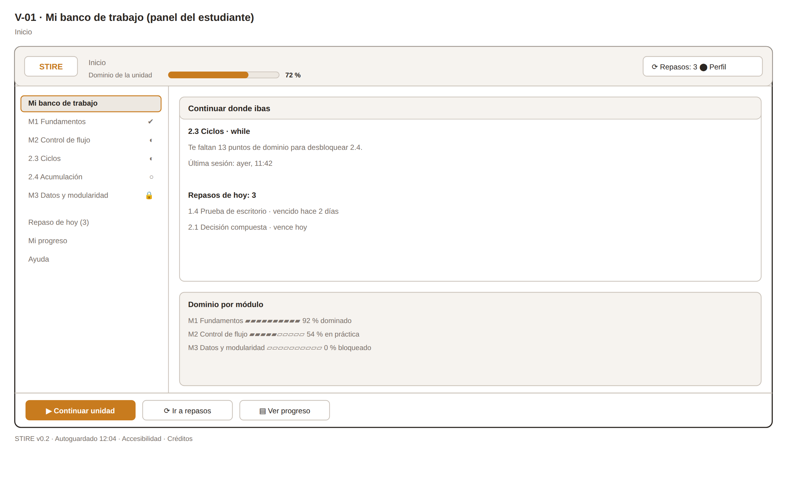

*Fuente editable: [`assets/3.3.1_v01_banco_trabajo.svg`](assets/3.3.1_v01_banco_trabajo.svg)*

| # | Categoría | Descripción |
|---|---|---|
| 1 | **Imagen** | Iconografía lineal monocromática de 24 px (SVG) para estados de unidad y acciones. Ilustración de cabecera única, plana, sin texto embebido. Sin fotografías: evitan la fatiga visual y no aportan información algorítmica. |
| 2 | **Nombre de ventana** | Interno: `V-01_BANCO_TRABAJO` · Visible: **"Mi banco de trabajo"** |
| 3 | **Texto** | Saludo breve (1 línea), tres tarjetas de estado (*Continuar donde ibas*, *Repasos de hoy*, *Dominio del módulo*). Registro cercano y directo, segunda persona, frases ≤ 20 palabras. Sin jerga técnica no introducida aún. |
| 4 | **Audio** | **No aplica.** El panel es de consulta rápida (< 30 s) y suele usarse en sala de cómputo compartida. Un audio no solicitado sería intrusivo y no aporta información que el texto no dé mejor. |
| 5 | **Video** | **No aplica** salvo el primer ingreso: video de bienvenida opcional de 60 s, silenciable y descartable de forma permanente. Después no se muestra. |
| 6 | **Animación** | Barra de dominio con transición de 400 ms al actualizarse (hace perceptible el avance). Aparición escalonada de tarjetas (60 ms). Sin bucles infinitos ni parpadeos. Respeta `prefers-reduced-motion`. |
| 7 | **Acciones** | Continuar unidad en curso `[GET /learning-progress/me]` · Abrir repasos del día `[GET /review-schedules/due]` · Navegar a una unidad desbloqueada · Abrir el tutor · Ver progreso detallado. Toda acción registra metadato de interacción. |

### Ficha V-02 · Unidad de aprendizaje (contenido teórico)

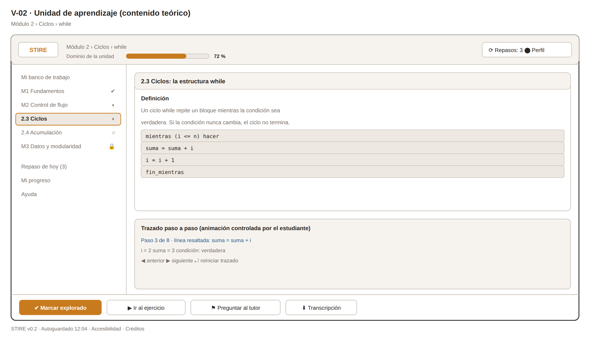

*Fuente editable: [`assets/3.3.1_v02_unidad_teoria.svg`](assets/3.3.1_v02_unidad_teoria.svg)*

| # | Categoría | Descripción |
|---|---|---|
| 1 | **Imagen** | Diagramas de flujo y esquemas conceptuales en SVG (escalables y legibles con zoom). Toda imagen lleva texto alternativo descriptivo. Capturas de código como texto seleccionable, **nunca** como imagen. |
| 2 | **Nombre de ventana** | Interno: `V-02_UNIDAD_TEORIA` · Visible: nombre de la unidad (p. ej. **"2.3 Ciclos: while"**) |
| 3 | **Texto** | Cuerpo teórico en Markdown renderizado: definición, ejemplo resuelto y trazado paso a paso. Bloques de ≤ 150 palabras separados por ejemplo ejecutable. Nivel de lectura para estudiante sin experiencia previa. Glosario emergente al pasar sobre un término marcado. |
| 4 | **Audio** | **No aplica** como narración obligatoria. Se ofrece lectura por voz del texto vía tecnología asistiva del navegador (accesibilidad), sin locución producida: la locución fija impone un ritmo que perjudica la lectura de código. |
| 5 | **Video** | **Aplica.** Cápsula de 3–6 min por unidad, subtitulada, con control de velocidad, marcadores por concepto y transcripción descargable. Es material de apoyo, no sustituye el texto. |
| 6 | **Animación** | Animación paso a paso del trazado de escritorio: resalta la línea en ejecución y actualiza la tabla de variables. Controlada por el estudiante (avanzar / retroceder), nunca automática. Es la pieza multimedial con mayor valor pedagógico de esta ventana: hace visible el estado de la memoria. |
| 7 | **Acciones** | Marcar como explorado `[POST /learning-progress/:unitId/explored]` · Avanzar/retroceder el trazado · Abrir el ejercicio asociado · Preguntar al tutor sobre el fragmento seleccionado `[POST /tutor/chat]` · Descargar transcripción. |

### Ficha V-03 · Resolución de ejercicio (banco de trabajo activo)

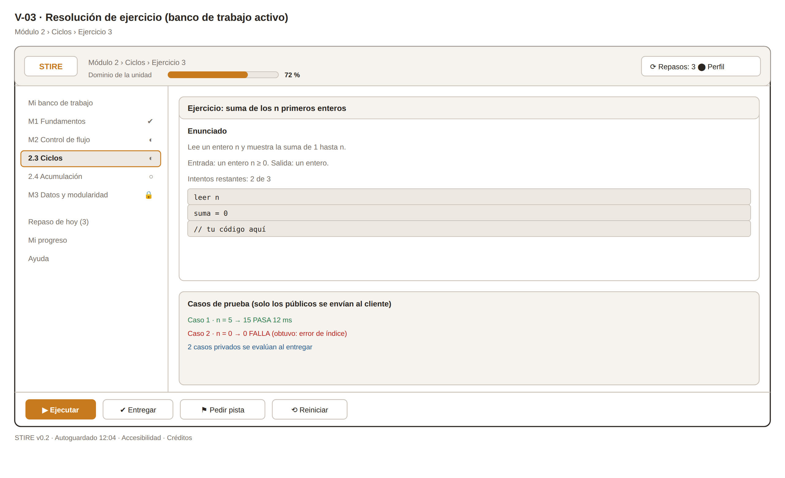

*Fuente editable: [`assets/3.3.1_v03_ejercicio.svg`](assets/3.3.1_v03_ejercicio.svg)*

| # | Categoría | Descripción |
|---|---|---|
| 1 | **Imagen** | Iconos de estado de caso de prueba (✔ pasa · ✖ falla · ⏱ tiempo excedido). Sin decoración: cualquier elemento gráfico no funcional compite con el enunciado y el editor. |
| 2 | **Nombre de ventana** | Interno: `V-03_EJERCICIO` · Visible: **"Ejercicio: "** + título del ejercicio |
| 3 | **Texto** | Enunciado estructurado (contexto, entrada, salida esperada, restricciones), ejemplos de entrada/salida y contador de intentos restantes. Enunciado ≤ 200 palabras; los casos límite van en ejemplos, no en prosa. |
| 4 | **Audio** | **No aplica** como contenido. Solo dos señales sonoras cortas y desactivables por defecto: éxito y fallo de la ejecución, para no obligar a mirar la pantalla durante la espera del juez. |
| 5 | **Video** | **No aplica.** El video obligaría a abandonar el estado mental del problema. La ayuda audiovisual pertenece a V-02 y es accesible desde el enlace a la teoría de la unidad. |
| 6 | **Animación** | Indicador de progreso durante la ejecución en el sandbox (estados: en cola → ejecutando → evaluando). Los casos de prueba se revelan en secuencia conforme el juez responde. Sin animación en el editor. |
| 7 | **Acciones** | Ejecutar contra casos públicos `[POST /judge/run]` · Entregar `[POST /submissions]` (consume intento, exige confirmación) · Pedir pista `[POST /tutor/hint]` · Reiniciar plantilla (confirmación) · Autoguardado periódico del borrador. **Los casos con `isPublic: false` nunca se envían al cliente.** |

### Ficha V-04 · Retroalimentación del tutor inteligente

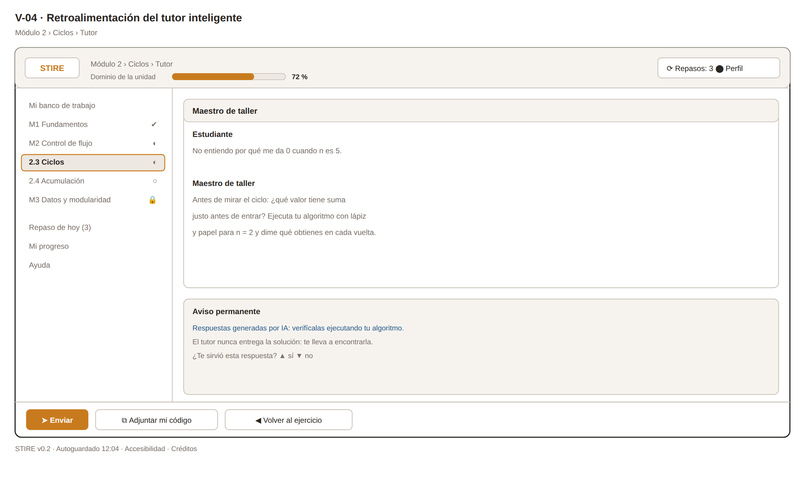

*Fuente editable: [`assets/3.3.1_v04_tutor.svg`](assets/3.3.1_v04_tutor.svg)*

| # | Categoría | Descripción |
|---|---|---|
| 1 | **Imagen** | Avatar geométrico abstracto del tutor (no humanoide, no antropomórfico): evita atribuirle autoridad o infalibilidad humana. Marcas visuales que distinguen mensaje del tutor de mensaje del estudiante. |
| 2 | **Nombre de ventana** | Interno: `V-04_TUTOR` · Visible: **"Maestro de taller"** (metáfora rectora, §3.3.2) |
| 3 | **Texto** | Diálogo socrático: el tutor responde con preguntas guía, contraejemplos y señalamientos sobre el propio código del estudiante. **Nunca entrega la solución**. Turnos ≤ 80 palabras. Aviso permanente y visible: *"Respuestas generadas por IA: verifícalas ejecutando tu algoritmo."* |
| 4 | **Audio** | **No aplica.** Sintetizar voz sobre texto generado por IA aumenta la percepción de autoridad de una fuente que puede equivocarse. Decisión pedagógica deliberada, no limitación técnica. |
| 5 | **Video** | **No aplica.** El intercambio es contextual e irrepetible; ningún video pregrabado puede responder al código concreto del estudiante. |
| 6 | **Animación** | Indicador de escritura mientras se genera la respuesta (evita la percepción de sistema congelado) y entrega progresiva del texto. Sin gestos ni expresiones del avatar. |
| 7 | **Acciones** | Enviar consulta `[POST /tutor/chat]` · Adjuntar el fragmento de código seleccionado como contexto · Marcar la respuesta como útil / no útil (insumo de calidad del tutor) · Volver al ejercicio conservando el borrador. Se persisten **metadatos** de interacción, no la conversación completa (RF-27). |

### Ficha V-05 · Repaso espaciado (SM-2)

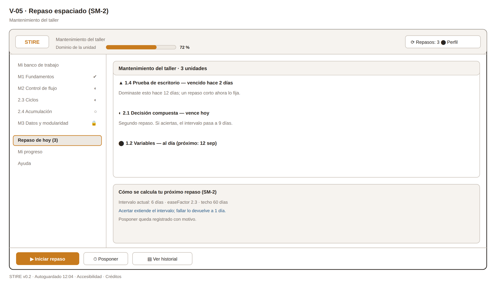

*Fuente editable: [`assets/3.3.1_v05_repaso.svg`](assets/3.3.1_v05_repaso.svg)*

| # | Categoría | Descripción |
|---|---|---|
| 1 | **Imagen** | Iconografía de urgencia con **doble codificación** (forma + color + etiqueta): ⬤ al día · ◐ vence mañana · ▲ vencido · ■ crítico. Curva del olvido como esquema explicativo en la primera visita. |
| 2 | **Nombre de ventana** | Interno: `V-05_REPASO` · Visible: **"Mantenimiento del taller"** |
| 3 | **Texto** | Lista de unidades con repaso programado, fecha de vencimiento, nivel de urgencia y explicación de una línea: *"Dominaste esto hace 12 días; un repaso corto ahora lo fija."* La justificación es obligatoria: sin ella el repaso se percibe como trabajo arbitrario. |
| 4 | **Audio** | **No aplica.** Sesión de trabajo focalizada y breve. |
| 5 | **Video** | **No aplica.** El repaso es recuperación activa; ver un video la sustituye por reconocimiento pasivo y anula el efecto del método. |
| 6 | **Animación** | Al completar un repaso, la tarjeta se desplaza fuera de la lista y la nueva fecha aparece con transición corta (≤ 300 ms): hace visible que el intervalo se extendió, que es el refuerzo conductual del método. |
| 7 | **Acciones** | Iniciar repaso de una unidad `[GET /review-schedules/due]` · Resolver el ejercicio de repaso (reutiliza V-03) · Posponer con motivo (registro auditable) · Ver historial de intervalos. La calificación actualiza `easeFactor` e intervalo SM-2. |

### Ficha V-06 · Mi progreso (bitácora de dominio)

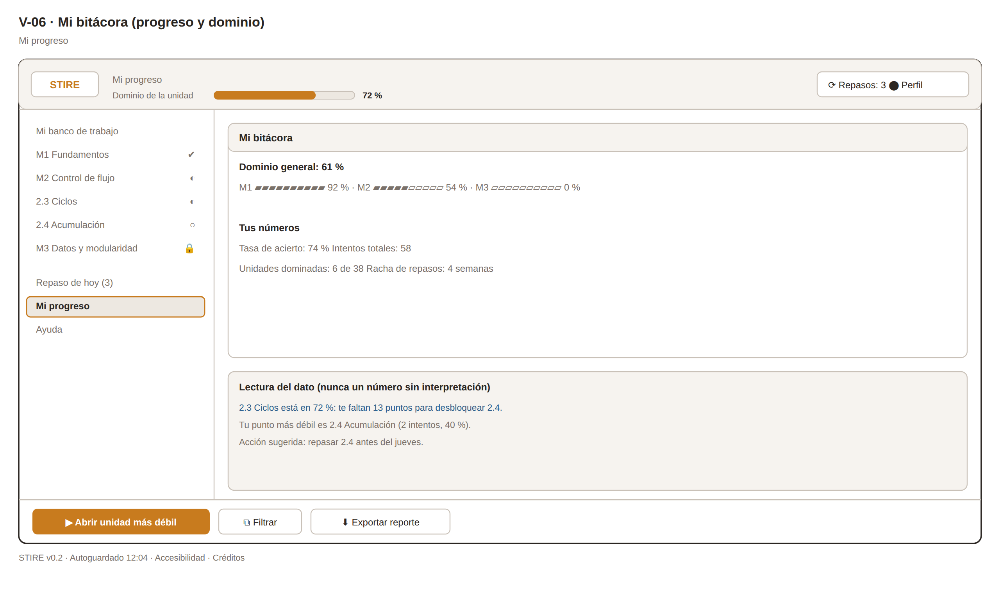

*Fuente editable: [`assets/3.3.1_v06_progreso.svg`](assets/3.3.1_v06_progreso.svg)*

| # | Categoría | Descripción |
|---|---|---|
| 1 | **Imagen** | Visualizaciones de datos: barras de dominio por módulo, mapa de calor de actividad, línea de evolución. Sin gráficas 3D ni efectos: distorsionan la lectura de magnitudes. |
| 2 | **Nombre de ventana** | Interno: `V-06_PROGRESO` · Visible: **"Mi bitácora"** |
| 3 | **Texto** | Métricas con su interpretación al lado: `mastery`, `successRate`, `attemptsCount`, unidades dominadas y racha de repasos. Cada métrica lleva una línea de lectura: *"72 %: te faltan 13 puntos para desbloquear 2.4."* Un número sin interpretación no orienta la acción. |
| 4 | **Audio** | **No aplica.** Ventana de consulta analítica. |
| 5 | **Video** | **No aplica.** El dato es propio y cambiante; ningún video puede describirlo. |
| 6 | **Animación** | Las barras crecen desde cero al cargar (400 ms) y la unidad que cambió desde la última visita se resalta brevemente. Sin animación en cada re-render, para no convertir el dato en espectáculo. |
| 7 | **Acciones** | Filtrar por módulo o rango de fechas · Abrir la unidad más débil (acción sugerida por el sistema) · Exportar reporte personal · Consultar al tutor sobre el plan de estudio `[POST /tutor/chat]`. |

---

---

## Vista consolidada — Formato 13 original

Presentación tabular equivalente, en el formato exacto del libro, para la sustentación:

| Ventana | Texto | Imagen | Audio | Videos | Animación | Acciones |
|---|---|---|---|---|---|---|
| **V-01 Mi banco de trabajo** | Saludo y 3 tarjetas de estado; frases ≤20 palabras | Iconografía lineal SVG 24 px + ilustración plana | No aplica: consulta rápida en sala compartida | Solo bienvenida opcional de 60 s en el primer ingreso | Barra de dominio con transición de 400 ms | Continuar unidad · abrir repasos · navegar · ver progreso |
| **V-02 Unidad de aprendizaje** | Teoría en bloques ≤150 palabras + glosario emergente | Diagramas de flujo SVG con texto alternativo | No aplica como locución; se soporta lectura por voz | Cápsula 3–6 min subtitulada (pendiente de producción) | **Trazado de escritorio paso a paso**, controlado por el estudiante | Marcar explorado · avanzar trazado · ir al ejercicio · preguntar al tutor |
| **V-03 Resolución de ejercicio** | Enunciado ≤200 palabras, ejemplos E/S, intentos restantes | Iconos de estado por caso de prueba | Dos señales cortas desactivadas por defecto | No aplica: obligaría a abandonar el problema | Indicador de progreso del juez; casos revelados en secuencia | Ejecutar · Entregar · Pedir pista · Reiniciar · autoguardado |
| **V-04 Maestro de taller** | Diálogo socrático, turnos ≤80 palabras, aviso de IA | Avatar geométrico no humanoide | No aplica **por decisión pedagógica** | No aplica: el intercambio es irrepetible | Indicador de escritura y entrega progresiva | Enviar consulta · adjuntar código · marcar utilidad · volver |
| **V-05 Mantenimiento (SM-2)** | Lista de repasos con justificación de una línea | Iconos de urgencia con doble codificación | No aplica: sesión breve y focalizada | No aplica: anularía la recuperación activa | Salida de la tarjeta y nueva fecha (≤300 ms) | Iniciar repaso · posponer con motivo · ver historial |
| **V-06 Mi bitácora** | Métricas con su línea de interpretación | Barras, mapa de calor y línea de evolución | No aplica: ventana analítica | No aplica: el dato es propio y cambiante | Barras que crecen al cargar; resalte de lo que cambió | Filtrar · abrir unidad más débil · exportar · consultar al tutor |

---

## Trazabilidad con los requisitos funcionales

| Ventana | RF cubiertos | Módulo del sistema |
|---|---|---|
| V-01 | RF-08, RF-10, RF-11, RF-22, RF-23 | Seguimiento del aprendizaje · Recomendación de repaso |
| V-02 | RF-05, RF-06, RF-07, RF-09 | Gestión de unidades de aprendizaje |
| V-03 | RF-17, RF-18, RF-19, RF-20 | Evaluación de conceptos · Judge |
| V-04 | RF-12 a RF-16, RF-25 a RF-27 | Tutor inteligente · Registro de interacciones |
| V-05 | RF-21, RF-22, RF-23, RF-24 | Recomendación de repaso (SM-2) |
| V-06 | RF-08, RF-10, RF-11 | Seguimiento del aprendizaje |
| V-00 *(fuera de esta entrega)* | RF-01 a RF-04 | Gestión de usuarios |

---

# § 3.3.2 · Guía de Metáforas — STIRE

**Norma:** MODESEC §3.3.2 · **Formato 14** (Diseño de guía de metáforas) · `DDS3-01.pdf` §3.3.2
**Dueño:** Julio · **Estado:** ✅ 12 metáforas · **Última actualización:** 2026-08-28

---

## 1. Metáfora rectora

> ## 🔨 El taller del algoritmista

MODESEC pide que la metáfora vaya **asociada al contexto de la población y al ambiente de
aprendizaje**. No pide un catálogo de iconos: pide una analogía que dé sentido al conjunto.

**Justificación pedagógica (anclada en MOCAVI).** MOCAVI sitúa el aprendizaje en la actividad
mediada y el trabajo colaborativo sobre problemas reales. El taller es el espacio donde se aprende
un oficio **produciendo piezas**, con un maestro que corrige el procedimiento y no el resultado, y
donde el error es parte esperada del proceso, no una sanción. Para estudiantes de tercer semestre
que llegan con miedo al error de compilación, esta metáfora reencuadra el fallo como **prueba de
banco**: algo que se hace a propósito, muchas veces, antes de dar por buena una pieza. Sostiene
además el repaso espaciado, que en un taller real no es castigo sino **mantenimiento del
herramental**.

---

## 2. Equivalencias de la metáfora

| Elemento de la interfaz | Equivalente en la metáfora | Qué comunica al estudiante |
|---|---|---|
| Panel principal (V-01) | **Mi banco de trabajo** | "Este es tu puesto: aquí está lo que dejaste a medias y lo que toca hoy." |
| Ejercicio (V-03) | **Pieza en el banco** | "Es un encargo concreto, con medidas y tolerancias: entrada, salida y restricciones." |
| Ejecutar sin entregar | **Prueba de banco** | "Ensaya cuantas veces quieras; probar no cuesta nada y no consume intento." |
| Intento fallido | **Pieza que no pasa la medida** | "No pasó la verificación. Se ajusta y se vuelve a probar: eso es el oficio." |
| Tutor IA (V-04) | **Maestro de taller** | "Te muestra dónde mirar y te pregunta por qué; no hace la pieza por ti." |
| Casos de prueba | **Calibradores** | "Criterios objetivos y públicos: no dependen de la opinión de nadie." |
| Nivel de dominio (`mastery`) | **Temple de la herramienta** | "Se gana con uso repetido y se pierde con el desuso; por eso hay repasos." |
| Repaso espaciado (V-05) | **Mantenimiento del herramental** | "Se afila antes de que se desafile, no cuando ya falló." |
| Unidad bloqueada | **Encargo fuera de tu nivel** | "Aún no tienes la base; termina el encargo anterior y se abre." |
| Progreso del módulo (V-06) | **Bitácora del taller** | "Registro de lo que has producido y de lo que domina tu mano." |

---

## 3. Formato 14 — Guía de metáforas (iconografía)

<table>
<tr><th align="center">DISEÑO DE GUÍA DE METÁFORAS</th><th></th><th></th></tr>
<tr><th align="left">Nombre</th><th align="center">Imagen</th><th align="left">Descripción</th></tr>
<tr><td width="220"><b>Mi banco de trabajo</b></td><td align="center" width="90"></td><td>Panel del estudiante (V-01): lo que dejó a medias y lo que toca hoy.</td></tr>
<tr><td width="220"><b>Encargo / pieza</b></td><td align="center" width="90"></td><td>Ejercicio con medidas y tolerancias: entrada, salida y restricciones.</td></tr>
<tr><td width="220"><b>Prueba de banco</b></td><td align="center" width="90"></td><td>Ejecutar sin entregar: ensayo ilimitado que no consume intento.</td></tr>
<tr><td width="220"><b>Calibrador</b></td><td align="center" width="90"></td><td>Casos de prueba: criterio objetivo y público, no opinión.</td></tr>
<tr><td width="220"><b>Maestro de taller</b></td><td align="center" width="90"></td><td>Tutor IA (V-04): pregunta y señala; nunca hace la pieza por ti.</td></tr>
<tr><td width="220"><b>Temple</b></td><td align="center" width="90"></td><td>Nivel de dominio (mastery): se gana con uso y se pierde con desuso.</td></tr>
<tr><td width="220"><b>Mantenimiento</b></td><td align="center" width="90"></td><td>Repaso espaciado SM-2: se afila antes de que se desafile.</td></tr>
<tr><td width="220"><b>Encargo fuera de nivel</b></td><td align="center" width="90"></td><td>Unidad bloqueada por el grafo de prerrequisitos.</td></tr>
<tr><td width="220"><b>Bitácora</b></td><td align="center" width="90"></td><td>Progreso y dominio (V-06): registro de lo producido.</td></tr>
<tr><td width="220"><b>Entregar</b></td><td align="center" width="90"></td><td>Consume intento y dispara la evaluación del juez.</td></tr>
<tr><td width="220"><b>Pedir pista</b></td><td align="center" width="90"></td><td>Abre al maestro de taller con el contexto del código actual.</td></tr>
<tr><td width="220"><b>Cerrar sesión</b></td><td align="center" width="90"></td><td>Sale del taller guardando el estado del banco.</td></tr>
</table>

**Hoja completa de iconografía:**


*Iconos individuales en [`assets/icons/`](assets/icons/) (SVG, 48×48, trazo 2.2 px).*

---

## 4. Consistencia visual derivada de la metáfora

> **Criterio de calidad:** si la metáfora es un taller y los iconos son de videojuego, la metáfora
> no está aplicada — está declarada.

| Dimensión | Decisión |
|---|---|
| **Paleta** | Base neutra de taller (grises cálidos, madera clara). Acento único **ámbar `#C87B1E`** para la acción primaria. Semánticos: verde `#2F7D4F` = pasa, rojo `#B3261E` = falla, azul `#2B5D8A` = información del maestro. Ningún color decorativo compite con el acento. |
| **Iconografía** | Trazo lineal uniforme, esquinas rectas, sin relleno. Vocabulario de herramienta e instrumento de medición. **Prohibidos** trofeos, medallas, cofres y demás repertorio de videojuego: contradicen el encuadre de oficio y desplazan la motivación intrínseca. |
| **Tipografía** | Sans serif humanista para interfaz; **monoespaciada para todo el código, sin excepción**. |
| **Lenguaje** | Verbos de oficio: *ensayar, ajustar, verificar, entregar*. Se evita *ganar*, *perder*, *puntos* y *vidas*. |
| **Gamificación** | Fuera del alcance de esta fase. Si se incorpora, será como registro de oficio (bitácora, sellos de calidad), nunca como economía de puntos. |

---

## 5. Accesibilidad de la iconografía

1. Ningún icono comunica solo por color: todos llevan **forma distintiva + etiqueta textual**.
2. Todo icono tiene `alt` descriptivo y área clicable mínima de 44 × 44 px.
3. Los iconos de estado (dominio, urgencia de repaso) usan **doble codificación**: forma + color + texto.

---

# § 3.3.3 · Mapa de Navegación — STIRE

**Norma:** MODESEC §3.3.3 · **Gráfico 2** (Esquema de navegación) · `DDS3-01.pdf` §3.3.3
**Dueño:** Julio · **Estado:** ✅ completo · **Última actualización:** 2026-08-28

> **Qué es esta pieza.** MODESEC: *"al culminar el diseño de todas las ventanas se hace
> indispensable la creación de una guía o mapa que permita ubicar de forma ordenada cada una de las
> interfaces"*. El mapa muestra cómo están organizadas las ventanas y qué hipervínculo las
> interconecta. No es un dibujo decorativo: es lo que permite detectar ventanas huérfanas antes de
> programarlas.

---

## 1. Esquema de navegación

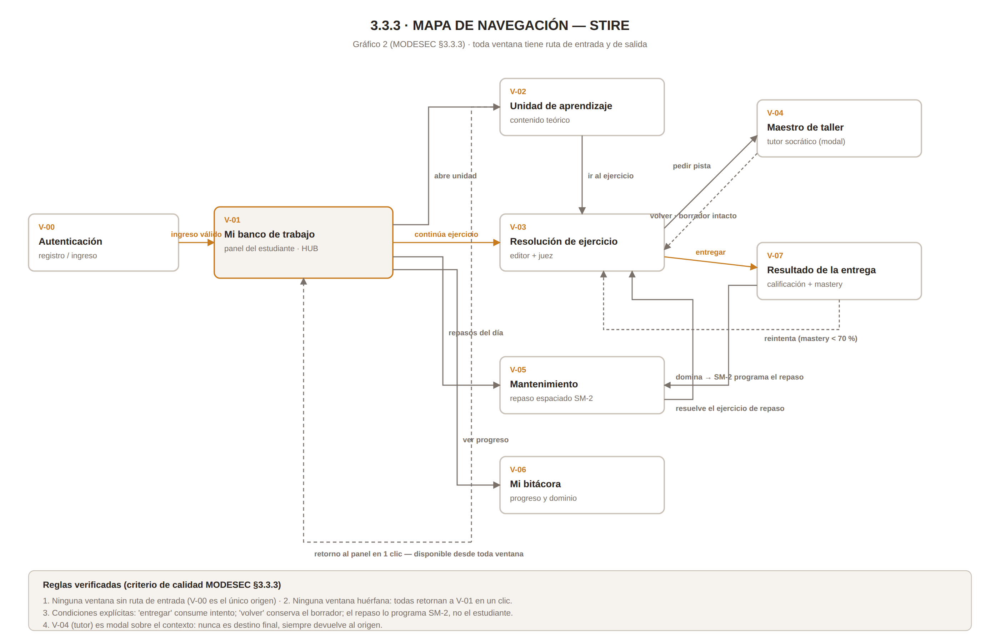

*Fuente editable: [`assets/3.3.3_mapa_navegacion.svg`](assets/3.3.3_mapa_navegacion.svg)*

<details>
<summary>Versión en Mermaid (se renderiza directamente en GitHub)</summary>

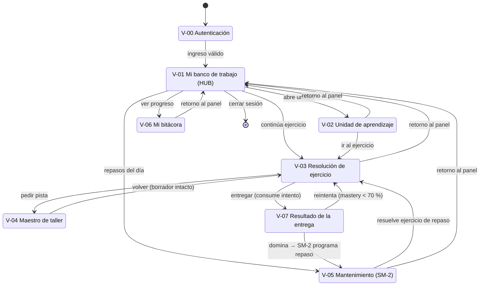
</details>

---

## 2. Tabla de transiciones

| # | Origen | Destino | Disparador / condición | ¿Reversible? | Efecto en el sistema |
|---|---|---|---|---|---|
| 1 | — | V-00 Autenticación | Arranque de la aplicación | — | — |
| 2 | V-00 | V-01 Banco de trabajo | Credenciales válidas | No (requiere cerrar sesión) | Se emite el token de sesión |
| 3 | V-01 | V-02 Unidad | Clic en unidad **desbloqueada** (`mastery` del prerrequisito ≥ 70 %) | Sí | Estado → *Explorado* |
| 4 | V-01 | V-03 Ejercicio | Clic en "Continuar" o en una actividad de la unidad | Sí | Se carga el borrador autoguardado |
| 5 | V-01 | V-05 Mantenimiento | Clic en "Repaso de hoy" (existe al menos un repaso vencido o del día) | Sí | — |
| 6 | V-01 | V-06 Bitácora | Clic en "Mi progreso" | Sí | — |
| 7 | V-02 | V-03 | Clic en "Ir al ejercicio" | Sí | — |
| 8 | V-03 | V-04 Tutor | Clic en "Pedir pista" | Sí (modal) | Se adjunta el código actual como contexto |
| 9 | V-04 | V-03 | "Volver al ejercicio" | Sí | **El borrador se conserva intacto** |
| 10 | V-03 | V-07 Resultado | Clic en "Entregar" + confirmación | **No: consume intento** | Se crea la entrega, se ejecuta el juez y se recalcula `mastery` |
| 11 | V-07 | V-03 | "Reintentar" (si `mastery` < 70 % y quedan intentos) | Sí | Nuevo intento sobre el mismo ejercicio |
| 12 | V-07 | V-05 | Automático al alcanzar dominio | — | SM-2 programa `nextReviewDate` |
| 13 | V-05 | V-03 | "Iniciar repaso" | Sí | Se abre el ejercicio de repaso de la unidad |
| 14 | cualquiera | V-01 | Clic en la marca o en "Mi banco de trabajo" | Sí | Guarda el borrador antes de salir |
| 15 | V-01 | — | "Cerrar sesión" | — | Invalida la sesión; el borrador queda persistido |

---

## 3. Reglas de calidad verificadas

| # | Regla | Verificación |
|---|---|---|
| 1 | Ninguna ventana sin ruta de entrada | ✅ V-00 es el único origen; todas las demás se alcanzan desde V-01 o desde una transición explícita |
| 2 | Ninguna ventana huérfana (sin salida) | ✅ Las 8 ventanas retornan a V-01 en un clic |
| 3 | Toda ventana con retorno al panel principal | ✅ Transición 14, disponible desde el header |
| 4 | Condiciones de transición explícitas | ✅ *entregar* consume intento; *volver* conserva el borrador; el repaso lo programa SM-2, no el estudiante |
| 5 | El tutor nunca es destino final | ✅ V-04 es modal sobre el contexto y siempre devuelve al origen |
| 6 | No hay calificación sin entrega | ✅ V-07 solo se alcanza desde V-03 mediante la transición 10 |

---

## 4. Decisiones de navegación y su razón

**V-01 es un hub, no una portada.** Podría haberse diseñado una pantalla de bienvenida decorativa;
se descartó. El panel es funcional desde el primer segundo porque el estudiante entra con una
pregunta concreta —"¿qué hago hoy?"— y el sistema ya sabe la respuesta.

**El tutor es modal, no una sección.** Si el tutor fuera un destino de navegación, el estudiante
podría "irse a preguntar" abandonando el problema. Siendo modal sobre el contexto, la consulta
ocurre **con el código a la vista** y el regreso es inmediato.

**El repaso no se puede adelantar.** El estudiante no elige cuándo repasar: lo programa SM-2. Si
pudiera adelantarlo a voluntad, el algoritmo de repetición espaciada perdería su efecto, que depende
precisamente del intervalo.

**La entrega tiene fricción deliberada.** Es la única transición irreversible del sistema, y por eso
es la única que pide confirmación. La fricción no es un descuido de usabilidad: comunica que ahí
cambia el estado académico del estudiante.

---

## Fuentes

- Guía de la asignatura `DDS3-01.pdf` (2024) — *3. Fase II: Diseño Multimedial*, §3.1 a §3.3.3.
- Caro, M., Toscano, R., Hernández, F. y David, M. (2012). *MODESEC: Modelo para el desarrollo de software educativo basado en competencias.* Formatos 10 a 14 y Gráficos 1 y 2.
- Caro, M. et al. (2009). *MODESEC*. Nuevas Ideas en Informática Educativa, 5, 188–200.
- Guía de trabajo del estudiante, Clase 02 — DDSE3, Universidad de Córdoba.
- *Modelo pedagógico Educación virtual — MOCAVI* (2023).
- Giraldo, J. C. (2004). *Metodología SEMLI*. Montería.
- Documentación interna STIRE: `docs/STIRE_FUNCTIONAL_VISION.md`, documento maestro de requisitos (RF-01 a RF-27).
