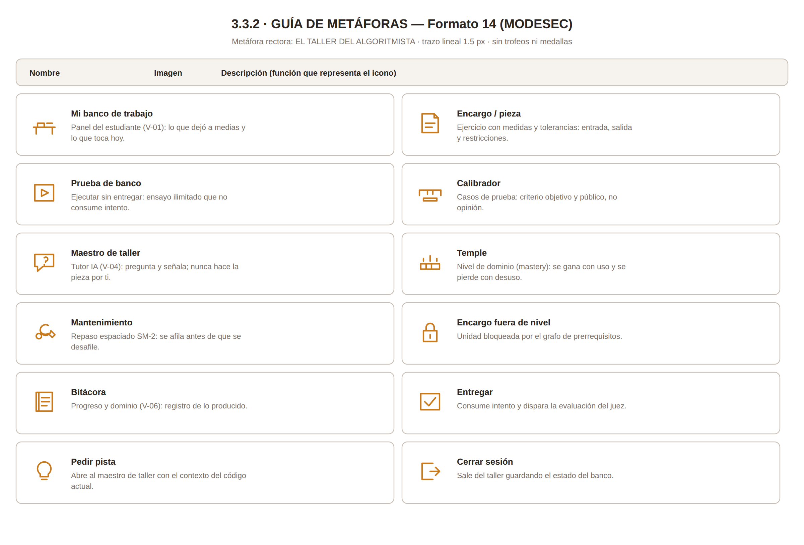

# § 3.3.2 · Guía de Metáforas — STIRE

**Norma:** MODESEC §3.3.2 · **Formato 14** (Diseño de guía de metáforas) · `DDS3-01.pdf` §3.3.2
**Dueño:** Julio · **Estado:** ✅ 12 metáforas · **Última actualización:** 2026-08-28

---

## 1. Metáfora rectora

> ## 🔨 El taller del algoritmista

MODESEC pide que la metáfora vaya **asociada al contexto de la población y al ambiente de
aprendizaje**. No pide un catálogo de iconos: pide una analogía que dé sentido al conjunto.

**Justificación pedagógica (anclada en MOCAVI).** MOCAVI sitúa el aprendizaje en la actividad
mediada y el trabajo colaborativo sobre problemas reales. El taller es el espacio donde se aprende
un oficio **produciendo piezas**, con un maestro que corrige el procedimiento y no el resultado, y
donde el error es parte esperada del proceso, no una sanción. Para estudiantes de tercer semestre
que llegan con miedo al error de compilación, esta metáfora reencuadra el fallo como **prueba de
banco**: algo que se hace a propósito, muchas veces, antes de dar por buena una pieza. Sostiene
además el repaso espaciado, que en un taller real no es castigo sino **mantenimiento del
herramental**.

---

## 2. Equivalencias de la metáfora

| Elemento de la interfaz | Equivalente en la metáfora | Qué comunica al estudiante |
|---|---|---|
| Panel principal (V-01) | **Mi banco de trabajo** | "Este es tu puesto: aquí está lo que dejaste a medias y lo que toca hoy." |
| Ejercicio (V-03) | **Pieza en el banco** | "Es un encargo concreto, con medidas y tolerancias: entrada, salida y restricciones." |
| Ejecutar sin entregar | **Prueba de banco** | "Ensaya cuantas veces quieras; probar no cuesta nada y no consume intento." |
| Intento fallido | **Pieza que no pasa la medida** | "No pasó la verificación. Se ajusta y se vuelve a probar: eso es el oficio." |
| Tutor IA (V-04) | **Maestro de taller** | "Te muestra dónde mirar y te pregunta por qué; no hace la pieza por ti." |
| Casos de prueba | **Calibradores** | "Criterios objetivos y públicos: no dependen de la opinión de nadie." |
| Nivel de dominio (`mastery`) | **Temple de la herramienta** | "Se gana con uso repetido y se pierde con el desuso; por eso hay repasos." |
| Repaso espaciado (V-05) | **Mantenimiento del herramental** | "Se afila antes de que se desafile, no cuando ya falló." |
| Unidad bloqueada | **Encargo fuera de tu nivel** | "Aún no tienes la base; termina el encargo anterior y se abre." |
| Progreso del módulo (V-06) | **Bitácora del taller** | "Registro de lo que has producido y de lo que domina tu mano." |

---

## 3. Formato 14 — Guía de metáforas (iconografía)

<table>
<tr><th align="center">DISEÑO DE GUÍA DE METÁFORAS</th><th></th><th></th></tr>
<tr><th align="left">Nombre</th><th align="center">Imagen</th><th align="left">Descripción</th></tr>
<tr><td width="220"><b>Mi banco de trabajo</b></td><td align="center" width="90"></td><td>Panel del estudiante (V-01): lo que dejó a medias y lo que toca hoy.</td></tr>
<tr><td width="220"><b>Encargo / pieza</b></td><td align="center" width="90"></td><td>Ejercicio con medidas y tolerancias: entrada, salida y restricciones.</td></tr>
<tr><td width="220"><b>Prueba de banco</b></td><td align="center" width="90"></td><td>Ejecutar sin entregar: ensayo ilimitado que no consume intento.</td></tr>
<tr><td width="220"><b>Calibrador</b></td><td align="center" width="90"></td><td>Casos de prueba: criterio objetivo y público, no opinión.</td></tr>
<tr><td width="220"><b>Maestro de taller</b></td><td align="center" width="90"></td><td>Tutor IA (V-04): pregunta y señala; nunca hace la pieza por ti.</td></tr>
<tr><td width="220"><b>Temple</b></td><td align="center" width="90"></td><td>Nivel de dominio (mastery): se gana con uso y se pierde con desuso.</td></tr>
<tr><td width="220"><b>Mantenimiento</b></td><td align="center" width="90"></td><td>Repaso espaciado SM-2: se afila antes de que se desafile.</td></tr>
<tr><td width="220"><b>Encargo fuera de nivel</b></td><td align="center" width="90"></td><td>Unidad bloqueada por el grafo de prerrequisitos.</td></tr>
<tr><td width="220"><b>Bitácora</b></td><td align="center" width="90"></td><td>Progreso y dominio (V-06): registro de lo producido.</td></tr>
<tr><td width="220"><b>Entregar</b></td><td align="center" width="90"></td><td>Consume intento y dispara la evaluación del juez.</td></tr>
<tr><td width="220"><b>Pedir pista</b></td><td align="center" width="90"></td><td>Abre al maestro de taller con el contexto del código actual.</td></tr>
<tr><td width="220"><b>Cerrar sesión</b></td><td align="center" width="90"></td><td>Sale del taller guardando el estado del banco.</td></tr>
</table>

**Hoja completa de iconografía:**

*Iconos individuales en [`assets/icons/`](../assets/icons/) (SVG, 48×48, trazo 2.2 px).*

---

## 4. Consistencia visual derivada de la metáfora

> **Criterio de calidad:** si la metáfora es un taller y los iconos son de videojuego, la metáfora
> no está aplicada — está declarada.

| Dimensión | Decisión |
|---|---|
| **Paleta** | Base neutra de taller (grises cálidos, madera clara). Acento único **ámbar `#C87B1E`** para la acción primaria. Semánticos: verde `#2F7D4F` = pasa, rojo `#B3261E` = falla, azul `#2B5D8A` = información del maestro. Ningún color decorativo compite con el acento. |
| **Iconografía** | Trazo lineal uniforme, esquinas rectas, sin relleno. Vocabulario de herramienta e instrumento de medición. **Prohibidos** trofeos, medallas, cofres y demás repertorio de videojuego: contradicen el encuadre de oficio y desplazan la motivación intrínseca. |
| **Tipografía** | Sans serif humanista para interfaz; **monoespaciada para todo el código, sin excepción**. |
| **Lenguaje** | Verbos de oficio: *ensayar, ajustar, verificar, entregar*. Se evita *ganar*, *perder*, *puntos* y *vidas*. |
| **Gamificación** | Fuera del alcance de esta fase. Si se incorpora, será como registro de oficio (bitácora, sellos de calidad), nunca como economía de puntos. |

---

## 5. Accesibilidad de la iconografía

1. Ningún icono comunica solo por color: todos llevan **forma distintiva + etiqueta textual**.
2. Todo icono tiene `alt` descriptivo y área clicable mínima de 44 × 44 px.
3. Los iconos de estado (dominio, urgencia de repaso) usan **doble codificación**: forma + color + texto.
