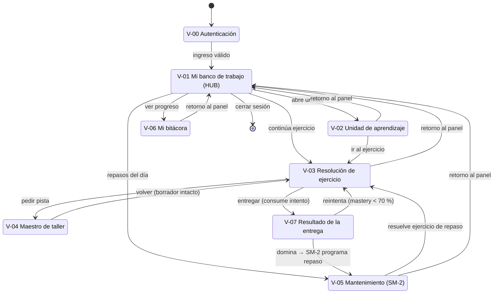

# § 3.3.3 · Mapa de Navegación — STIRE

**Norma:** MODESEC §3.3.3 · **Gráfico 2** (Esquema de navegación) · `DDS3-01.pdf` §3.3.3
**Dueño:** Julio · **Estado:** ✅ completo · **Última actualización:** 2026-08-28

> **Qué es esta pieza.** MODESEC: *"al culminar el diseño de todas las ventanas se hace
> indispensable la creación de una guía o mapa que permita ubicar de forma ordenada cada una de las
> interfaces"*. El mapa muestra cómo están organizadas las ventanas y qué hipervínculo las
> interconecta. No es un dibujo decorativo: es lo que permite detectar ventanas huérfanas antes de
> programarlas.

---

## 1. Esquema de navegación

*Fuente editable: [`assets/3.3.3_mapa_navegacion.svg`](../assets/3.3.3_mapa_navegacion.svg)*

Versión en Mermaid (se renderiza directamente en GitHub)

---

## 2. Tabla de transiciones

| # | Origen | Destino | Disparador / condición | ¿Reversible? | Efecto en el sistema |
|---|---|---|---|---|---|
| 1 | — | V-00 Autenticación | Arranque de la aplicación | — | — |
| 2 | V-00 | V-01 Banco de trabajo | Credenciales válidas | No (requiere cerrar sesión) | Se emite el token de sesión |
| 3 | V-01 | V-02 Unidad | Clic en unidad **desbloqueada** (`mastery` del prerrequisito ≥ 70 %) | Sí | Estado → *Explorado* |
| 4 | V-01 | V-03 Ejercicio | Clic en "Continuar" o en una actividad de la unidad | Sí | Se carga el borrador autoguardado |
| 5 | V-01 | V-05 Mantenimiento | Clic en "Repaso de hoy" (existe al menos un repaso vencido o del día) | Sí | — |
| 6 | V-01 | V-06 Bitácora | Clic en "Mi progreso" | Sí | — |
| 7 | V-02 | V-03 | Clic en "Ir al ejercicio" | Sí | — |
| 8 | V-03 | V-04 Tutor | Clic en "Pedir pista" | Sí (modal) | Se adjunta el código actual como contexto |
| 9 | V-04 | V-03 | "Volver al ejercicio" | Sí | **El borrador se conserva intacto** |
| 10 | V-03 | V-07 Resultado | Clic en "Entregar" + confirmación | **No: consume intento** | Se crea la entrega, se ejecuta el juez y se recalcula `mastery` |
| 11 | V-07 | V-03 | "Reintentar" (si `mastery` < 70 % y quedan intentos) | Sí | Nuevo intento sobre el mismo ejercicio |
| 12 | V-07 | V-05 | Automático al alcanzar dominio | — | SM-2 programa `nextReviewDate` |
| 13 | V-05 | V-03 | "Iniciar repaso" | Sí | Se abre el ejercicio de repaso de la unidad |
| 14 | cualquiera | V-01 | Clic en la marca o en "Mi banco de trabajo" | Sí | Guarda el borrador antes de salir |
| 15 | V-01 | — | "Cerrar sesión" | — | Invalida la sesión; el borrador queda persistido |

---

## 3. Reglas de calidad verificadas

| # | Regla | Verificación |
|---|---|---|
| 1 | Ninguna ventana sin ruta de entrada | ✅ V-00 es el único origen; todas las demás se alcanzan desde V-01 o desde una transición explícita |
| 2 | Ninguna ventana huérfana (sin salida) | ✅ Las 8 ventanas retornan a V-01 en un clic |
| 3 | Toda ventana con retorno al panel principal | ✅ Transición 14, disponible desde el header |
| 4 | Condiciones de transición explícitas | ✅ *entregar* consume intento; *volver* conserva el borrador; el repaso lo programa SM-2, no el estudiante |
| 5 | El tutor nunca es destino final | ✅ V-04 es modal sobre el contexto y siempre devuelve al origen |
| 6 | No hay calificación sin entrega | ✅ V-07 solo se alcanza desde V-03 mediante la transición 10 |

---

## 4. Decisiones de navegación y su razón

**V-01 es un hub, no una portada.** Podría haberse diseñado una pantalla de bienvenida decorativa;
se descartó. El panel es funcional desde el primer segundo porque el estudiante entra con una
pregunta concreta —"¿qué hago hoy?"— y el sistema ya sabe la respuesta.

**El tutor es modal, no una sección.** Si el tutor fuera un destino de navegación, el estudiante
podría "irse a preguntar" abandonando el problema. Siendo modal sobre el contexto, la consulta
ocurre **con el código a la vista** y el regreso es inmediato.

**El repaso no se puede adelantar.** El estudiante no elige cuándo repasar: lo programa SM-2. Si
pudiera adelantarlo a voluntad, el algoritmo de repetición espaciada perdería su efecto, que depende
precisamente del intervalo.

**La entrega tiene fricción deliberada.** Es la única transición irreversible del sistema, y por eso
es la única que pide confirmación. La fricción no es un descuido de usabilidad: comunica que ahí
cambia el estado académico del estudiante.
